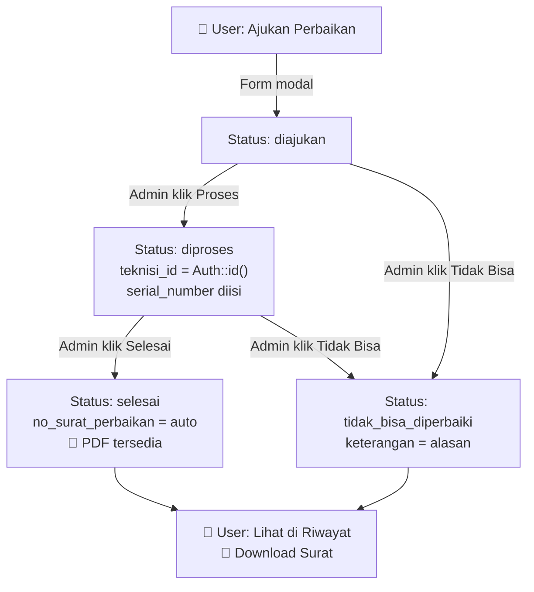

# Implementasi Fitur Perbaikan & Reorganisasi Menu Admin/User

## Latar Belakang

Proyek SILANKOM memiliki 2 pola fitur request-approval yang sudah berjalan:

| Fitur | Sisi User (Pengajuan) | Sisi Admin (Kelola) |
|---|---|---|
| **Peminjaman** | `ReqPinjamResource` → `RiwayatPeminjamanResource` | `PengajuanResource` → `PeminjamanAdminResource` |
| **Dukungan** | `ReqDukunganResource` | `KelolaDukunganResource` + `MonitoringDukungan` |

Fitur **Perbaikan** akan mengikuti pola Peminjaman (paling lengkap) dengan 2 resource per sisi:

| Sisi | Resource | Fungsi |
|---|---|---|
| **User** | `ReqPerbaikanResource` | Ajukan perbaikan baru + lihat status |
| **User** | `RiwayatPerbaikanResource` | Riwayat perbaikan yang sudah selesai/ditolak |
| **Admin** | `PengajuanPerbaikanResource` | Kelola pengajuan masuk (approve/reject/proses) |
| **Admin** | `KelolaPerbaikanResource` | Histori semua perbaikan + cetak surat |

---

## Keputusan Desain

> [!NOTE]
> **PK menggunakan `id` default Laravel** — konsisten dengan konvensi proyek yang ada (bukan `id_perbaikan`).

> [!NOTE]
> **Teknisi otomatis** — `teknisi_id` diisi otomatis dengan `Auth::id()` (admin yang sedang login yang memproses) — tidak ada dropdown pilih teknisi.

> [!NOTE]
> **Format Nomor Surat** — Mengikuti pola yang sudah ada: `Perbaikan/TTPPE/III/001/2026/Komlek`

> [!NOTE]
> **Hak Akses** — Belum diimplementasikan; menu dipisahkan secara visual melalui `$navigationGroup`.

> [!NOTE]
> **Notifikasi** — Belum diimplementasikan di tahap ini.

---

## Proposed Changes

### Komponen 1: Database Migration

#### [NEW] `database/migrations/xxxx_create_perbaikan_table.php`

```php
Schema::create('perbaikan', function (Blueprint $table) {
    $table->id();
    
    // Diisi oleh User (Pemohon)
    $table->foreignId('pemohon_id')->constrained('users')->cascadeOnDelete()->cascadeOnUpdate();
    $table->foreignId('kategori_id')->constrained('kategori_barang')->cascadeOnDelete()->cascadeOnUpdate();
    $table->foreignId('merek_id')->constrained('merek')->cascadeOnDelete()->cascadeOnUpdate();
    $table->string('nm_barang');
    $table->date('tgl_pengajuan');
    $table->text('keluhan');                    // Keluhan user
    $table->integer('jumlah')->default(1);
    $table->string('nodis');                    // Nomor disposisi
    
    // Diisi oleh Admin/Teknisi saat proses
    $table->string('serial_number')->nullable();
    $table->text('keterangan')->nullable();      // Keterangan teknisi
    $table->enum('status', [
        'diajukan',
        'diproses',
        'selesai',
        'tidak_bisa_diperbaiki',
    ])->default('diajukan');
    $table->string('no_surat_perbaikan')->nullable();
    $table->foreignId('teknisi_id')->nullable()->constrained('users')->cascadeOnDelete()->cascadeOnUpdate();
    
    $table->timestamps();
});
```

---

### Komponen 2: Model

#### [NEW] [PerbaikanModel.php](file:///w:/laragon/www/silankom/app/Models/PerbaikanModel.php)

Mengikuti konvensi `ReqDukunganModel`:

```php
class PerbaikanModel extends Model
{
    protected $table = 'perbaikan';
    protected $guarded = [];

    protected function casts(): array
    {
        return [
            'tgl_pengajuan' => 'date',
        ];
    }

    public function pemohon(): BelongsTo     { return $this->belongsTo(User::class, 'pemohon_id'); }
    public function kategori(): BelongsTo    { return $this->belongsTo(KategoriModel::class, 'kategori_id'); }
    public function merek(): BelongsTo       { return $this->belongsTo(MerekModel::class, 'merek_id'); }
    public function teknisi(): BelongsTo     { return $this->belongsTo(User::class, 'teknisi_id'); }
}
```

---

### Komponen 3: Sisi USER — Pengajuan Perbaikan

Pola: `ReqDukunganResource` (user ajukan, hanya lihat miliknya sendiri)

#### [NEW] `app/Filament/Resources/ReqPerbaikans/ReqPerbaikanResource.php`

| Property | Value |
|---|---|
| `$model` | `PerbaikanModel::class` |
| `$navigationGroup` | `'Perbaikan'` |
| `$navigationLabel` | `'Ajukan Perbaikan'` |
| `$navigationIcon` | `Heroicon::Wrench` |
| `$slug` | `'req-perbaikan'` |
| `$navigationSort` | `1` |
| `getEloquentQuery()` | `->where('pemohon_id', Auth::id())` |

#### [NEW] `app/Filament/Resources/ReqPerbaikans/Schemas/ReqPerbaikanForm.php`

Form fields (diisi user saat create):
- `Select` → `kategori_id` (dari `kategori_barang`, searchable, preload)
- `Select` → `merek_id` (dari `merek`, searchable, preload)
- `TextInput` → `nm_barang` (required)
- `DatePicker` → `tgl_pengajuan` (default: today, native: false)
- `Textarea` → `keluhan` (required, rows: 3)
- `TextInput` → `jumlah` (numeric, min: 1, default: 1)
- `TextInput` → `nodis` (required)
- `Hidden` → `pemohon_id` = `Auth::id()`
- `Hidden` → `status` = `'diajukan'`

#### [NEW] `app/Filament/Resources/ReqPerbaikans/Tables/ReqPerbaikansTable.php`

Kolom yang ditampilkan (read-only untuk user):
- `rowIndex` → No
- `tgl_pengajuan` → Tanggal Pengajuan (date format)
- `kategori.nama_kategori` → Kategori (badge)
- `merek.nama_merek` → Merek
- `nm_barang` → Nama Barang
- `jumlah` → Jumlah
- `keluhan` → Keluhan (limit 30, wrap)
- `status` → Status (badge, warna sesuai status)
- `keterangan` → Keterangan Teknisi (placeholder '-')
- `teknisi.name` → Teknisi (placeholder '-')

#### [NEW] `app/Filament/Resources/ReqPerbaikans/Pages/ListReqPerbaikans.php`

Header action: `CreateAction` dalam modal (pola `ListReqDukungans`)
- Modal heading: 'Form Pengajuan Perbaikan'
- Submit label: 'Kirim Pengajuan'
- Cancel label: 'Batal'
- `createAnother(false)`

---

### Komponen 4: Sisi USER — Riwayat Perbaikan

Pola: `RiwayatPeminjamanResource` (user melihat riwayat, tidak bisa create)

#### [NEW] `app/Filament/Resources/RiwayatPerbaikans/RiwayatPerbaikanResource.php`

| Property | Value |
|---|---|
| `$model` | `PerbaikanModel::class` |
| `$navigationGroup` | `'Perbaikan'` |
| `$navigationLabel` | `'Riwayat Perbaikan'` |
| `$navigationIcon` | `Heroicon::ClipboardDocumentList` |
| `$slug` | `'riwayat-perbaikan'` |
| `$navigationSort` | `2` |
| `canCreate()` | `false` |
| `getEloquentQuery()` | `->where('pemohon_id', Auth::id())->whereIn('status', ['selesai', 'tidak_bisa_diperbaiki'])` |

#### [NEW] `app/Filament/Resources/RiwayatPerbaikans/Tables/RiwayatPerbaikansTable.php`

Kolom: Sama seperti ReqPerbaikansTable + `no_surat_perbaikan`, `serial_number`

Action: Download PDF surat perbaikan (jika `no_surat_perbaikan` sudah terisi)

#### [NEW] `app/Filament/Resources/RiwayatPerbaikans/Pages/ListRiwayatPerbaikans.php`

---

### Komponen 5: Sisi ADMIN — Pengajuan Perbaikan Masuk

Pola: `PengajuanResource` (admin lihat semua pengajuan, approve/reject/proses)

#### [NEW] `app/Filament/Resources/PengajuanPerbaikans/PengajuanPerbaikanResource.php`

| Property | Value |
|---|---|
| `$model` | `PerbaikanModel::class` |
| `$navigationGroup` | `'Admin Perbaikan'` |
| `$navigationLabel` | `'Pengajuan Perbaikan'` |
| `$navigationIcon` | `Heroicon::InboxStack` |
| `$slug` | `'pengajuan-perbaikan'` |
| `$navigationSort` | `1` |
| `canCreate()` | `false` |
| `getNavigationBadge()` | count status `'diajukan'` |
| `getNavigationBadgeColor()` | `'warning'` |

#### [NEW] `app/Filament/Resources/PengajuanPerbaikans/Tables/PengajuanPerbaikansTable.php`

Kolom (lengkap, with eager load `pemohon`, `kategori`, `merek`, `teknisi`):
- `rowIndex`, `pemohon.name` (desc NIP + Unit Kerja), `kategori.nama_kategori`, `merek.nama_merek`
- `nm_barang`, `jumlah`, `nodis`, `tgl_pengajuan`, `keluhan` (limit 40)
- `status` (badge + icon), `teknisi.name`, `keterangan`

**Actions (ActionGroup per-baris):**

1. **View Detail** — Modal view detail (pola `PengajuansTable`)
   - Menampilkan data pemohon + rincian pengajuan dalam card HTML

2. **Proses / Ambil Alih** — Visible saat status `'diajukan'`
   - Form: `TextInput` serial_number, `Textarea` keterangan
   - Action: Update status → `'diproses'`, set `teknisi_id = Auth::id()`

3. **Selesai** — Visible saat status `'diproses'`
   - Form: `Textarea` keterangan (pre-filled)
   - Action: Update status → `'selesai'`, generate `no_surat_perbaikan` via `NomorSuratService`

4. **Tidak Bisa Diperbaiki** — Visible saat status `'diajukan'` atau `'diproses'`
   - Form: `Textarea` keterangan (required, alasan)
   - Action: Update status → `'tidak_bisa_diperbaiki'`, set `teknisi_id = Auth::id()` jika belum

**Filters:**
- `SelectFilter` status
- `SelectFilter` kategori (relationship)
- `Filter` tanggal_pengajuan (range dari-sampai)

#### [NEW] `app/Filament/Resources/PengajuanPerbaikans/Pages/ListPengajuanPerbaikans.php`

---

### Komponen 6: Sisi ADMIN — Kelola / Histori Perbaikan

Pola: `PeminjamanAdminResource` (admin lihat semua, histori + download PDF)

#### [NEW] `app/Filament/Resources/KelolaPerbaikans/KelolaPerbaikanResource.php`

| Property | Value |
|---|---|
| `$model` | `PerbaikanModel::class` |
| `$navigationGroup` | `'Admin Perbaikan'` |
| `$navigationLabel` | `'Kelola Perbaikan'` |
| `$navigationIcon` | `Heroicon::ClipboardDocumentCheck` |
| `$slug` | `'kelola-perbaikan'` |
| `$navigationSort` | `2` |
| `canCreate()` | `false` |
| `getNavigationBadge()` | count status `'diproses'` |
| `getNavigationBadgeColor()` | `'info'` |

#### [NEW] `app/Filament/Resources/KelolaPerbaikans/Tables/KelolaPerbaikansTable.php`

Kolom (lengkap termasuk `no_surat_perbaikan`, `serial_number`):
- Semua kolom + nomor surat (copyable, styled) + tanggal selesai

**Actions:**
- Download PDF surat perbaikan (visible jika `no_surat_perbaikan` terisi)

**Filters:**
- `SelectFilter` status
- `SelectFilter` kategori
- `Filter` tanggal range

#### [NEW] `app/Filament/Resources/KelolaPerbaikans/Pages/ListKelolaPerbaikans.php`

---

### Komponen 7: Nomor Surat Perbaikan

#### [MODIFY] [NomorSuratService.php](file:///w:/laragon/www/silankom/app/Services/NomorSuratService.php)

Tambahkan method:

```php
public static function generatePerbaikan(): string
{
    $bulan = now()->format('m');
    $tahun = now()->format('Y');
    $bulanRomawi = self::toRoman((int) $bulan);

    $lastNumber = PerbaikanModel::whereYear('created_at', $tahun)
        ->whereMonth('created_at', $bulan)
        ->whereNotNull('no_surat_perbaikan')
        ->count();

    $nomorUrut = str_pad($lastNumber + 1, 3, '0', STR_PAD_LEFT);

    return "Perbaikan/TTPPE/{$bulanRomawi}/{$nomorUrut}/{$tahun}/Komlek";
}
```

---

### Komponen 8: PDF Surat Perbaikan

#### [MODIFY] [TandaTerimaService.php](file:///w:/laragon/www/silankom/app/Services/TandaTerimaService.php)

Tambahkan method `generatePerbaikan(PerbaikanModel $perbaikan)` yang:
- Eager load relasi `pemohon.jabatan`, `pemohon.unitkerja`, `kategori`, `merek`, `teknisi.jabatan`, `teknisi.unitkerja`
- Load view `pdf.surat_perbaikan_template`
- Stream PDF

#### [NEW] `resources/views/pdf/surat_perbaikan_template.blade.php`

Template mengikuti format tanda terima yang sudah ada:
- Kop surat: "SEKRETARIAT UTAMA LEMHANNAS RI / BIRO TELEMATIKA"
- Judul: "SURAT KETERANGAN PERBAIKAN PERALATAN ELEKTRONIK"
- Nomor surat
- Data: Nama, NIP, Unit Kerja, Jabatan, Barang, Merek, Serial Number, Jumlah, Keluhan, Keterangan
- Tanda tangan: Yang Memperbaiki (teknisi) ↔ Pemilik Barang (pemohon)

#### [MODIFY] [web.php](file:///w:/laragon/www/silankom/routes/web.php)

Tambahkan route:

```php
Route::get('/download-surat-perbaikan/{perbaikan}', function (PerbaikanModel $perbaikan) {
    return TandaTerimaService::generatePerbaikan($perbaikan);
})->middleware('auth')->name('download.surat-perbaikan');
```

---

### Komponen 9: Reorganisasi Navigation Menu

#### Struktur Menu Baru

```
📁 User Menu
├── 📂 Peminjaman
│   ├── 📋 Ajukan Peminjaman          (ReqPinjamResource)         — sort 1
│   └── 📋 Riwayat Peminjaman         (RiwayatPeminjamanResource) — sort 2
├── 📂 Dukungan
│   └── 📋 Ajukan Dukungan            (ReqDukunganResource)       — sort 1
└── 📂 Perbaikan                                                    [NEW GROUP]
    ├── 📋 Ajukan Perbaikan           (ReqPerbaikanResource)      — sort 1  [NEW]
    └── 📋 Riwayat Perbaikan          (RiwayatPerbaikanResource)  — sort 2  [NEW]

📁 Admin Menu
├── 📂 Admin Peminjaman
│   ├── 📋 Pengajuan Peminjaman       (PengajuanResource)         — sort 1
│   └── 📋 Kelola Peminjaman          (PeminjamanAdminResource)   — sort 2
├── 📂 Admin Dukungan
│   ├── 📋 Kelola Dukungan            (KelolaDukunganResource)    — sort 1
│   └── 📋 Monitoring Dukungan        (MonitoringDukungan page)   — sort 2
├── 📂 Admin Perbaikan                                              [NEW GROUP]
│   ├── 📋 Pengajuan Perbaikan        (PengajuanPerbaikanResource) — sort 1 [NEW]
│   └── 📋 Kelola Perbaikan           (KelolaPerbaikanResource)    — sort 2 [NEW]
└── 📂 Master Inventaris
    ├── 📋 Barang / Inventaris        (BarangResource)
    ├── 📋 Kategori, Merek, dll.
```

> Tidak ada perubahan pada resource yang sudah ada — hanya penambahan resource baru.

---

## Ringkasan File

### File Baru (14 file)

| # | Lokasi | Tipe |
|---|---|---|
| 1 | `database/migrations/xxxx_create_perbaikan_table.php` | Migration |
| 2 | `app/Models/PerbaikanModel.php` | Model |
| 3 | `app/Filament/Resources/ReqPerbaikans/ReqPerbaikanResource.php` | User Resource |
| 4 | `app/Filament/Resources/ReqPerbaikans/Schemas/ReqPerbaikanForm.php` | User Form |
| 5 | `app/Filament/Resources/ReqPerbaikans/Tables/ReqPerbaikansTable.php` | User Table |
| 6 | `app/Filament/Resources/ReqPerbaikans/Pages/ListReqPerbaikans.php` | User Page |
| 7 | `app/Filament/Resources/RiwayatPerbaikans/RiwayatPerbaikanResource.php` | User History Resource |
| 8 | `app/Filament/Resources/RiwayatPerbaikans/Tables/RiwayatPerbaikansTable.php` | User History Table |
| 9 | `app/Filament/Resources/RiwayatPerbaikans/Pages/ListRiwayatPerbaikans.php` | User History Page |
| 10 | `app/Filament/Resources/PengajuanPerbaikans/PengajuanPerbaikanResource.php` | Admin Resource |
| 11 | `app/Filament/Resources/PengajuanPerbaikans/Tables/PengajuanPerbaikansTable.php` | Admin Table |
| 12 | `app/Filament/Resources/PengajuanPerbaikans/Pages/ListPengajuanPerbaikans.php` | Admin Page |
| 13 | `app/Filament/Resources/KelolaPerbaikans/KelolaPerbaikanResource.php` | Admin History Resource |
| 14 | `app/Filament/Resources/KelolaPerbaikans/Tables/KelolaPerbaikansTable.php` | Admin History Table |
| 15 | `app/Filament/Resources/KelolaPerbaikans/Pages/ListKelolaPerbaikans.php` | Admin History Page |
| 16 | `resources/views/pdf/surat_perbaikan_template.blade.php` | PDF Template |

### File Dimodifikasi (2 file)

| # | File | Perubahan |
|---|---|---|
| 1 | `app/Services/NomorSuratService.php` | Tambah `generatePerbaikan()` |
| 2 | `app/Services/TandaTerimaService.php` | Tambah `generatePerbaikan()` |
| 3 | `routes/web.php` | Tambah route download surat perbaikan |

---

## Alur Kerja Fitur



---

## Verification Plan

### Automated
1. `php artisan migrate` — pastikan migration berhasil
2. `php artisan test --compact` — pastikan tidak ada regresi

### Manual
1. Login → cek menu "Perbaikan" ada: Ajukan Perbaikan + Riwayat Perbaikan
2. Login → cek menu "Admin Perbaikan" ada: Pengajuan Perbaikan + Kelola Perbaikan
3. User: Ajukan perbaikan baru via modal → cek muncul di tabel
4. Admin: Proses pengajuan → cek status berubah, teknisi_id terisi otomatis
5. Admin: Selesaikan perbaikan → cek nomor surat tergenerate
6. Admin: Download PDF surat perbaikan → cek format sesuai
7. User: Cek riwayat perbaikan → bisa download surat
8. Badge count di sidebar tampil benar
